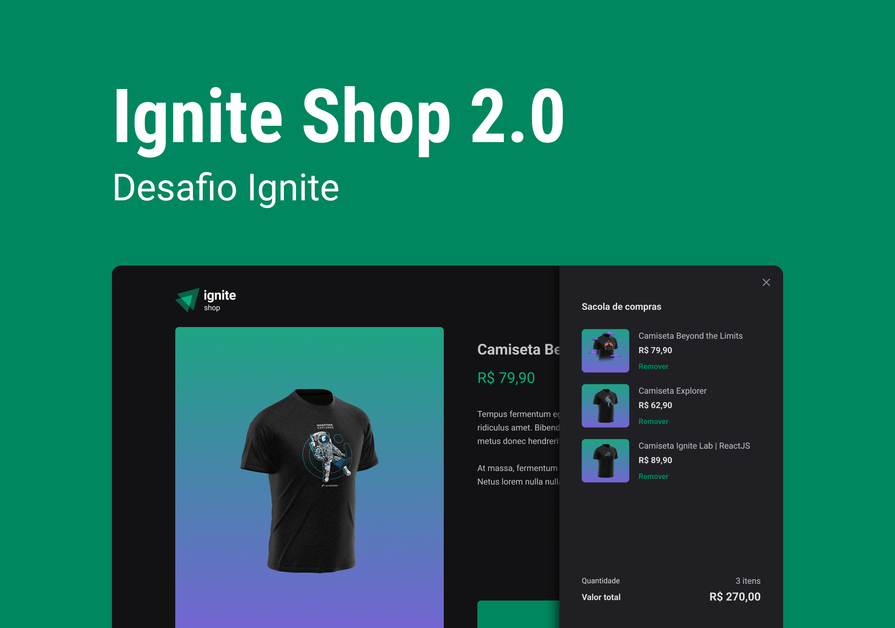

# Ignite Shop

<p align="center">
  
  
</p>
<br>

O Ignite Shop é um ecommerce para compra de camisetas desenvolvido com Next.js e a API do Stripe. Dessa forma, para uma maior performance da aplicação, foram utilizados os conceitos de SSR, SSG e data fetching do Next.js. Além disso, para essa aplicação foi implementado um contexto para controle do carrinho do usuário.

<div align="center">
  
</div>

## Getting Started

Para executar esse projeto será necessário ter o [Node.js](https://nodejs.org/) e o [npm](https://npmjs.com/) instalados.

Instale as dependências:

```shell
npm i
```

Configure as variáveis de ambiente conforme o arquivo [.env.example](.env.example) onde `NEXT_URL` é o endereço em que a aplicação está executando (por padrão `http://localhost:3000`). Também será necessário configurar uma conta no stripe para obter as keys para teste seguindo essa [documentação](https://stripe.com/docs/keys).

Para testar a aplicação será necessário criar produtos e preços no stripe. É possível obter mais informações sobre a criação de produtos e preços [aqui](https://stripe.com/docs/products-prices/getting-started#create-products-prices).

Após finalizar o setup, inicie a aplicação:

```shell
npm run dev
```

Por fim, é possível realizar testes de pagamento com uma série de cartões de teste listados pelo stripe nesse [link](https://stripe.com/docs/testing).

## Tecnologias

- [Axios](https://axios-http.com)
- [ESLint](https://eslint.org/)
- [Next.js](https://nextjs.org/)
- [Radix](https://radix-ui.com/)
- [ReactJS](https://reactjs.org/)
- [Stitches](https://stitches.dev/)
- [Stripe](https://stripe.com/)
- [Typescript](https://typescriptlang.org/)

## Licença

Este projeto está licenciado sob o MIT. Consulte a [licença](LICENSE) para mais informações.
